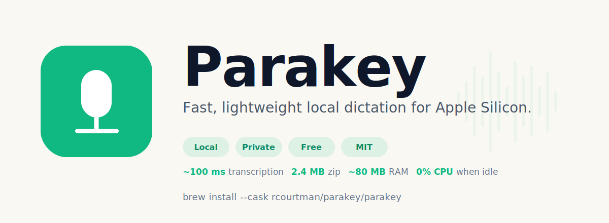

<p align="center">
  
</p>

<p align="center">
  <a href="https://github.com/rcourtman/parakey/releases/latest"></a>
  <a href="https://github.com/rcourtman/parakey/actions/workflows/check.yml"></a>
  <a href="https://github.com/rcourtman/parakey/blob/main/LICENSE"></a>
  
  <a href="https://github.com/rcourtman/homebrew-parakey"></a>
  <a href="https://rcourtman.github.io/parakey/"></a>
</p>

# Parakey

**Push-to-talk dictation for Apple Silicon. Hold a key, speak, let go —
text appears at the cursor in about 100 milliseconds.**

Native Swift, **on-device speech recognition**. Runs on the
**Apple Neural Engine (ANE)** via **CoreML**, executing the
[Parakeet TDT v3](https://huggingface.co/nvidia/parakeet-tdt-0.6b-v3)
model served by
[FluidAudio](https://github.com/FluidInference/FluidAudio). No cloud
transcription API, no subscription, no preferences window. An
alternative to Whisper-class Mac apps that lean on the GPU — the
ANE delivers both lower latency *and* lower power draw on battery.

> **~100 ms transcription** · **2.2 MB download** · **~80 MB RAM** · **0% CPU between dictations**

<p align="center">
  
</p>

- **Fast** — about **100 ms** from key release to pasted text on a
  typical 2–4 second clip. The encoder runs on the **Apple Neural
  Engine (ANE)** via CoreML — not the GPU, not the CPU. The
  decoder is a tiny autoregressive RNN-T loop, and the paste is
  just `Cmd+V` on the general pasteboard — no IPC, no subprocess
  hop, no cloud round-trip. By the time a cloud service has
  finished its TLS handshake, your text is already at the cursor.
  See [`experiments/swift-bench/`](experiments/swift-bench/) for
  apples-to-apples comparisons against alternative backends on the
  same hardware.

- **Lightweight** — **2.2 MB** signed, notarised release zip.
  Uses about **80 MB of RAM** while idle and **0% CPU** between
  dictations — roughly the same memory as a single open Safari tab.
  Single AOT-compiled Swift binary, no embedded interpreter, no
  JIT, no library-validation override, no background daemon, no
  telemetry, no autostart. CoreML keeps the speech model on the
  Neural Engine itself, so the in-app memory footprint stays small
  even though the model is loaded and ready. Two hardened-runtime
  entitlements (microphone + audio-input); that's the whole
  sandbox surface.

- **Private** — audio is captured in memory, transcribed locally,
  and discarded. Nothing leaves your Mac during dictation. No
  telemetry, no accounts, transcripts are never written to disk.
  Saved text corrections stay local unless you choose to keep them
  in a sync file. Parakey only reads and writes the file you choose;
  iCloud Drive, Dropbox, Syncthing, or another folder provider can
  move it between Macs. (Two narrow automatic runtime network
  exceptions: the first launch downloads the speech model, and
  Parakey checks GitHub every six hours for a newer release. Both are
  anonymous; the second is toggleable in Settings. Applying an update
  is a separate user-triggered action.)

- **Free** — MIT-licensed open source. No trials, no premium tier,
  no upsell.

- **Minimal** — one menu-bar icon. No dock clutter by default. No
  preferences window — every setting lives in the menu's Settings
  submenu.

- **Focused** — push-to-talk dictation with a small local corrections
  dictionary for recurring mishearings. No AI rewriting, no Parakey
  account, no Parakey cloud backend.

## Built on Apple's neural-ML stack

- **Apple Neural Engine (ANE)** — the dedicated machine-learning
  co-processor on every M-series Mac. Parakey's inference path
  targets it specifically (rather than the GPU or the CPU), via
  Apple's **CoreML** framework. ANE inference is both faster than
  GPU for this workload and materially less power-hungry, which
  matters when you're dictating heavily through a battery day.
- **Parakeet TDT v3** — NVIDIA's RNN-T (token-and-duration)
  streaming-capable speech model, ~600 MB. Compiled to CoreML and
  shipped as model weights via Hugging Face; runs on the ANE
  rather than the cloud.
- **[FluidAudio](https://github.com/FluidInference/FluidAudio)** —
  the Swift SDK that wraps CoreML + Parakeet into a clean
  `AsrManager` API. Open source, lean dependency surface, single
  SwiftPM declaration.
- **Apple's audio + UI frameworks all the way down** —
  AVFoundation for capture, CoreGraphics event taps for the hotkey,
  AppKit for the menu bar, NSAppleScript for the system-audio mute.
  No Electron, no embedded Chromium, no embedded interpreter — the
  whole app is one AOT-compiled Swift binary.

If you've been looking for a **fully on-device speech recognition**
app for the Mac that's an alternative to Whisper-on-GPU Mac apps
(MacWhisper, WhisperKit-based UIs) and to cloud transcription
services (OpenAI Whisper API, Google Speech-to-Text, Deepgram,
Apple's built-in dictation that pipes through Siri), Parakey is
exactly that — Push-to-Talk transcription on the **Apple Neural
Engine**, with the model running locally on your Mac and no audio
ever leaving the device.

The Parakeet TDT v3 weights (~600 MB) download once on first launch
into `~/Library/Application Support/FluidAudio/` and cache there;
nothing else to install.

Apple Silicon only. macOS 26 (Tahoe) or later.

## Requirements

- An Apple Silicon Mac (M1 or newer)
- macOS 26 (Tahoe) or later
- [Homebrew](https://brew.sh/) — only used by the installer for the
  Cask itself; Parakey has no other runtime dependencies

## Install (with an AI assistant)

Paste the prompt below into Claude Code, Cursor, Codex, or any shell-
capable agent running on the target Mac. It'll handle the Homebrew
install, walk you through the three permission grants, and explain
what to expect on first launch.

<details>
<summary>Click to expand the AI-assistant install prompt</summary>

````text
Install Parakey from https://github.com/rcourtman/parakey on this Mac.

Parakey is distributed as a notarised Homebrew Cask. Don't clone the
repo or build from source — `brew install --cask` is the canonical
end-user install path.

Steps:
1. Confirm this Mac is Apple Silicon (uname -m == arm64) and macOS 26+.
   If not, stop and tell me — Parakey is Apple Silicon only and
   requires macOS 26 (Tahoe).
2. Install Homebrew if missing (the installer at https://brew.sh).
3. Run:
     brew install --cask rcourtman/parakey/parakey
4. Launch the app:
     open /Applications/Parakey.app
5. Tell me the menu bar Parakey icon will appear shortly. First launch
   downloads a ~600 MB speech model from Hugging Face — this takes
   1–5 minutes on a typical connection, one-time only. The model is
   cached locally after that. Don't try the dictation key yet.
6. Once the icon appears, tell me to click it. Three rows will be
   visible: "⚠ Grant Microphone permission…", "⚠ Grant Accessibility
   permission…", "⚠ Grant Input Monitoring permission…". Tell me to
   click each one. Microphone lets Parakey hear speech; Accessibility
   lets it paste the transcript at the cursor; Input Monitoring lets
   it catch the push-to-talk key. Parakey will trigger the macOS prompt
   and/or open the right Settings pane. I should click Allow on the
   macOS dialog, or toggle Parakey on in Settings, for each of the
   three.
7. Rows turn ✓ as I grant each, and disappear from the menu once
   all three are granted. Parakey will not start recording until setup
   is complete.

Then the menu bar's status row will tell me which key to hold to
dictate. I can change it from Settings → Hotkey if I'd prefer
something else.

To upgrade later: Parakey checks GitHub every few hours and will
show an "Update to vX.Y.Z…" item at the top of its menu when a new
release is out — click it, the app handles the upgrade and relaunch.
The terminal fallback is still `brew upgrade --cask parakey` if I'd
rather drive it manually.
````

</details>

## Install (one-liner)

```sh
brew install --cask rcourtman/parakey/parakey
open /Applications/Parakey.app
```

That's it — the cask is signed and notarised, no Gatekeeper warnings.
First launch downloads the speech model (~600 MB, one-time, cached
locally). Click the Parakey menu bar icon to grant the three macOS
privacy permissions when it asks; Parakey stays in setup mode until
all three are granted.

To upgrade: just click **"Update to vX.Y.Z…"** when it appears at
the top of Parakey's menu — the app polls GitHub for new releases
every few hours and handles the upgrade and relaunch itself. Or run
`brew upgrade --cask parakey` manually if you prefer the terminal.

To uninstall:

```sh
brew uninstall --zap --cask parakey   # also removes preferences + logs
```

## Install (from source, for contributors)

If you want to hack on the code:

```sh
git clone https://github.com/rcourtman/parakey.git ~/parakey
cd ~/parakey/swift
./dev-run.sh
```

`dev-run.sh` is idempotent — re-run it any time. It compiles
`Sources/Parakey/main.swift` with `swift build`, wraps the binary in
a minimal `/tmp/Parakey-dev.app`, signs it with your Developer ID +
hardened runtime + the production entitlements (so TCC permissions
carry over from the Cask install — no manual re-grants), kills any
prior dev instance, and relaunches via `open`.

Requirements: Xcode 16+ (or the Swift 6.3+ toolchain) and a
Developer ID Application certificate in your keychain. The first
build also pulls FluidAudio from SwiftPM and downloads the Parakeet
TDT v3 CoreML weights (~600 MB, cached to `~/Library/Application
Support/FluidAudio/`).

Before producing the notarised release build that ships on Homebrew,
run `./ship-swift.sh --dry-run` first to exercise the build, signing,
entitlement check, and packaging path without notarising or stapling
(see *Building a release* below).

## First launch

The first time Parakey runs, it downloads the Parakeet TDT v3 model
(~600 MB) from Hugging Face into
`~/Library/Application Support/FluidAudio/`. This is a one-time
download — subsequent launches load the cached CoreML weights and
are ready in well under a second. During the download the menu bar
icon shows a loading indicator and the menu status row reports
checking, downloading, and preparing progress, so allow 1–5 minutes
on a typical connection.

After the model is loaded, Parakey still waits for the three macOS
privacy permissions below before it will record. Dictation only starts
once setup is complete.

## Permissions

Parakey needs three macOS privacy permissions and stays non-ready until
all three are granted:

- **Microphone** — captures your voice while the push-to-talk key is
  held.
- **Accessibility** — pastes the finished transcript into the focused
  app by posting `Cmd+V`.
- **Input Monitoring** — catches and suppresses the configured hotkey
  so it behaves like Parakey's push-to-talk trigger instead of leaking
  through to the focused app.

Until they're all granted, the menu bar dropdown shows rows like
**⚠ Grant Microphone permission…** just below the status row.

For each missing permission:

1. Click the ⚠ row in the menu — Parakey triggers the OS-level
   request (you may see a native "Parakey wants access" dialog) and
   opens the relevant Settings pane as a fallback.
2. Toggle Parakey on in the Settings pane if it isn't already.
3. The row updates to ✓ as soon as macOS reflects the new state, and
   once all three are granted the rows collapse out of the menu
   entirely.

No restart needed.

## Usage

Hold **Right Option** (the default — change in Settings → Hotkey if
you'd prefer something else), talk, release. The transcript is pasted
at the cursor. By default Parakey appends one space after each paste;
change this from Settings → Paste Behavior. A short tink confirms
recording started; a pop confirms it landed.

While the hotkey is held, system audio output is muted (so background
music doesn't bleed into the recording or distract you). It's restored
on release.

The menu bar icon reflects state via macOS's template-image tinting:
the parakeet glyph in the bar's normal label colour when idle, dimmed
while loading, **red** while recording, **yellow** if something went
wrong.

An optional floating waveform appears near the bottom of the screen
while recording. It is on by default and can be disabled under
**Settings → Show recording waveform**.

Recurring transcription mistakes can be fixed from **Settings → Text
Corrections**. Add the incorrect text Parakey typed under **Typed**
and the text it should paste under **Paste** — for example,
`clawed` → `Claude`. Corrections apply to whole words or phrases
after transcription and before paste/history.

Corrections can be exported, imported, shared with the macOS share
sheet, or synced through a user-chosen `.parakey-corrections` file.
For sync, put that file in iCloud Drive, Dropbox, Syncthing, or any
other folder that already syncs between your Macs. Parakey has no
account system and does not run a sync service; it just keeps the
chosen file up to date. The file is readable JSON, which keeps it
portable and easy to inspect.

Menu structure:

- **Status row** — what Parakey is doing right now (idle / recording /
  transcribing / paused / loading).
- **Permission rows** (only when something's missing) — a clickable
  ⚠ row per ungranted permission. Click → grant → row turns ✓ →
  rows disappear once all three are granted.
- **Recent transcripts** — the most recent one inline (click to copy
  it back to the clipboard); a **Recent** submenu appears once
  you've dictated more than once and holds older entries up to the
  configured limit. The whole transcript history is in-memory only,
  can be cleared or disabled from the menu, and clears when you quit
  Parakey.
- **Settings** ▶
  - **Hotkey** — Right Option (default), Right Control, Right
    Command, F5, F6, F13, F18, F19
  - **Trigger mode** — *Press and hold* or *Press to toggle*
  - **Paste Behavior** — append a space (default), no suffix, or
    append a newline after the pasted transcript
  - **Recent Transcripts** — last 5 (default), last 1, or off
  - **Microphone** — System default (default) or any specific input
    device. Switching takes effect immediately; if macOS reports an
    audio route change while idle, Parakey refreshes input without a
    relaunch. If the saved device is later unplugged, Parakey falls
    back to system default.
  - **Text Corrections** — add, edit, remove, import, export, share,
    or sync replacements for words and phrases the speech model
    consistently mishears
  - **Show recording waveform** — on by default; turn off to hide the
    floating waveform while recording
  - **Mute system audio while recording** — on by default; turn off
    if you'd rather music keep playing while you dictate
  - **Play feedback sounds** — on by default; turn off for silent
    start and completion feedback
  - **Show Parakey in Dock** — off by default (menu-bar only)
- **About Parakey**
- **Copy Diagnostics** — copies a transcript-free support summary
  with app version, permission states, selected microphone status,
  and settings metadata
- **Quit** — clean shutdown

A 2-minute hard cap auto-releases if the hotkey is held too long.

## How it works

1. A Quartz `CGEventTap` listens for the hotkey (modifier keys via
   `flagsChanged`, regular keys via `keyDown`/`keyUp`).
2. While held, an `AVAudioEngine` input tap captures mic audio and an
   `AVAudioConverter` resamples it to 16 kHz mono Float32 on the fly.
3. On release, the buffer is handed to a `TranscriptionWorker` actor
   that owns FluidAudio's `AsrManager`. The Parakeet TDT v3 CoreML
   models run on the Apple Neural Engine; the encoder is the bound
   work, the TDT decoder is autoregressive but tiny.
4. Local text corrections are applied, the transcript is placed on
   `NSPasteboard`, and `Cmd+V` is posted via `CGEvent`. System audio
   is unmuted via `NSAppleScript` and the "Pop" system sound plays.

The event tap suppresses only the configured hotkey while Parakey is
recording, so the press/release pair does not also trigger shortcuts
or text input in the focused app. Non-hotkey events pass through
normally.

For latency / accuracy numbers and the test methodology, see
[`experiments/swift-bench/`](experiments/swift-bench/).

## Customise

Most settings live in the menu's **Settings** submenu (described
above). All — **Hotkey**, **Trigger mode**, **Paste Behavior**,
**Recent Transcripts**, **Show recording waveform**,
**Mute system audio while recording**, **Microphone**, **Show Parakey
in Dock**, **Text Corrections**, **Check for updates automatically** —
persist across restarts via `NSUserDefaults`
(`~/Library/Preferences/com.local.parakey.plist`).

Power users can also poke them via `defaults` directly:

```sh
defaults write com.local.parakey hotkey_keycode -int 105   # F13
defaults write com.local.parakey trigger_mode toggle
defaults write com.local.parakey paste_suffix none          # space, none, or newline
defaults write com.local.parakey recent_transcripts -string off  # off, 1, or 5
defaults write com.local.parakey show_recording_waveform -bool false
defaults write com.local.parakey mute_while_recording -bool false
defaults write com.local.parakey show_in_dock -bool true
defaults write com.local.parakey input_device "AirPods Pro"  # exact device name or UID
defaults write com.local.parakey check_for_updates -bool false
# Then quit + relaunch Parakey to pick up settings that affect startup
# (most apply live; restart is only needed for the Dock toggle).
```

For deeper changes, constants live at the top of
`swift/Sources/Parakey/main.swift`:

| Constant | Default | Notes |
|---|---|---|
| `MIN_CLIP_SECONDS` | `0.25` | Recordings shorter than this are discarded (treated as accidental key-tap). |
| `MAX_RECORDING_SECONDS` | `120` | Auto-release if the hotkey is held longer. |
| `DEFAULT_RECENT_TRANSCRIPT_LIMIT` | `last5` | Rolling in-memory transcript history default; users can switch to last 1 or off. |
| `UPDATE_CHECK_INTERVAL_SECONDS` | `21600` (6 h) | How often the app polls GitHub for a newer release. |

After editing, rebuild + relaunch via `swift/dev-run.sh`.

## Updates

Parakey checks GitHub for a newer release every 6 hours (plus one
check 30 seconds after launch). When a newer version is published,
an **"Update to vX.Y.Z"** submenu appears at the top of the menu:

- **What's new…** — opens the release notes in a dialog with a link
  out to the full GitHub release page.
- **Update now…** — runs a detached Homebrew helper that refreshes the
  tap, upgrades the Cask, force-reinstalls if Homebrew reports success
  without replacing the bundle, verifies the installed app version, and
  then re-opens the app. No terminal needed.
- **Skip vX.Y.Z** — suppresses *just this version* without disabling
  the periodic check. A newer release published later still surfaces.

Disable the periodic poll entirely via **Settings → Check for
updates automatically**. To force an immediate check, quit and
relaunch Parakey — the 30-seconds-after-launch initial check fires
on every cold start.

What the update check sends: one anonymous HTTPS `GET` to
`api.github.com/repos/rcourtman/parakey/releases/latest`. Parakey sets
no request body, no auth header, no app or user identifier, and no
telemetry; the request uses Swift `URLSession` defaults plus the GitHub
JSON `Accept` header. The release body (used by
**What's new**) stays in memory and is never written to disk.
Skipped-version choices are stored locally in `NSUserDefaults`.

Source / non-brew installs: the update item still appears when a
newer release exists, but **Update now…** opens the GitHub releases
page in your browser rather than touching your local checkout.

## Building a release (maintainers)

`swift/dev-run.sh` is the *contributor* path — fast iteration, debug
build, dropped into `/tmp/Parakey-dev.app`.

`ship-swift.sh` is the *distribution* path — produces a self-contained,
signed, **notarised**, drag-installable `Parakey.app`. The bundle is
a thin wrapper around a single Mach-O Swift binary plus the menu-bar
PNGs and `.icns`; the CoreML weights are downloaded by FluidAudio on
first launch rather than embedded, so the ship-zip stays under 3 MB.

```sh
./ship-swift.sh --dry-run   # build + sign + entitlement check + package, skip notarise/staple/git/tag/release/cask
./ship-swift.sh             # actually ship (bumps patch: 0.2.x → 0.2.x+1)
./ship-swift.sh --minor     # 0.2.x → 0.3.0
./ship-swift.sh --major     # 0.x.x → 1.0.0
./ship-swift.sh --version 0.2.3
```

If a release-notes file exists at `swift/release-notes/v<new_version>.md`,
ship-swift.sh uses it for the GitHub release body; otherwise the body
is auto-generated from `git log <prev-tag>..<new-tag>`.

After the Homebrew tap commit is pushed, the release script refreshes
Homebrew's local metadata, asserts that `brew info --cask
rcourtman/parakey/parakey` reports the new version, and runs
`brew fetch --cask --force rcourtman/parakey/parakey` so the published
Cask URL and sha256 are verified before the script prints "Shipped".

Full release packaging produces:

- a signed, notarised, stapled `Parakey.app` bundle, wrapped for
  distribution
- `swift/dist/Parakey.zip` — the ditto-zipped bundle that GitHub
  Releases serves (≈2.2 MB; the version is in the GitHub release tag,
  not the filename). The temporary unzipped app bundle is removed after
  packaging so Launch Services does not prefer it over
  `/Applications/Parakey.app`.

With `--dry-run`, the build/sign/package validation path still leaves
`swift/dist/Parakey.zip`, but the app is not submitted to notarytool,
is not stapled, and the temporary `swift/dist/Parakey.app` bundle is
removed before exit.

### Notarisation (one-time setup)

Without notarisation, macOS Gatekeeper warns end users on first launch.
To enable notarisation in `ship-swift.sh`, run once:

```sh
xcrun notarytool store-credentials parakey-notary \
    --apple-id <YOUR_APPLE_ID> \
    --team-id  UJD57YVK2B \
    --password <APP_SPECIFIC_PASSWORD>
```

Generate the app-specific password at
[appleid.apple.com](https://appleid.apple.com) → *Sign-In and Security
→ App-Specific Passwords*. After this, every full `./ship-swift.sh`
release run will notarise + staple automatically.

## Logging

Parakey writes to `~/Library/Logs/Parakey.log`. The dev binary built
by `swift/dev-run.sh` writes to the same file (same bundle id), so a
single `tail -f` follows both.

Transcript content is **never** written to disk — only timing and
length metadata. There's no opt-in debug flag for logging
transcripts; the only way to see what the model heard is to read the
in-memory history from the menu while the app is still running. You
can clear that in-memory history from the menu at any time, or turn
it off under **Settings → Recent Transcripts**.

The **Copy Diagnostics** menu item is also transcript-free: it copies
version, permission, microphone, startup, and settings metadata for
support without including recent transcripts or text-correction
contents.

## Troubleshooting

| Symptom | Likely cause |
|---|---|
| Hotkey does nothing, no tink | Setup is not complete yet. Open the menu and clear any ⚠ permission rows; Parakey will not record until Microphone, Accessibility, and Input Monitoring are all granted. |
| Menu says "Grant permissions to finish setup" | Click each ⚠ row. Microphone is for audio capture, Accessibility is for paste-at-cursor, and Input Monitoring is for the push-to-talk key. |
| Menu bar shows "loading…" for several minutes on first launch | First-run model download from Hugging Face (~600 MB). One-time, then cached locally. |
| Music doesn't pause, only quietens | Parakey mutes system *output*, it doesn't pause Spotify/Music. Resumes on release. |
| The Parakey.app you downloaded won't open | Confirm Apple Silicon + macOS 26+. If it's an older release from before notarisation was set up, you may hit a Gatekeeper warning — right-click → Open → Open. |
| Clicked **Update now…** and the GitHub releases page opened instead of the app upgrading | Means brew either isn't installed at the expected path (`/opt/homebrew/bin/brew` or `/usr/local/bin/brew`), this install wasn't placed by `brew install --cask`, or Homebrew could not install the detected release. The release page is the safe fallback — install/upgrade manually from there. |
| Clicked **Update now…** but the new version didn't come back | Read `/tmp/parakey-update.log`. The helper logs `brew update`, `brew upgrade`, any forced reinstall, and the final installed bundle version. |

The in-menu permission rows surface most permission issues directly —
if you see ⚠ rows, click them. If you've toggled permissions in
Settings outside the app, the rows update within a few seconds after
macOS reflects the change.

If you've granted permissions but the macOS TCC database is stale,
clicking a ⚠ row twice in a row triggers `tccutil reset` on that
service for `com.local.parakey` — re-grant on the prompt that follows.

## Uninstall

```sh
brew uninstall --zap --cask parakey
```

`--zap` also clears `~/Library/Preferences/com.local.parakey.plist`
and `~/Library/Logs/Parakey.log`.

Optionally also remove the cached speech model:

```sh
rm -rf ~/Library/Application\ Support/FluidAudio/
```

And revoke permissions in System Settings → Privacy & Security.

## Support

Parakey is free and will stay free — same app whether or not you
sponsor, no upsells, no nag screens, no premium tier. But if it
saves you time and you'd like to throw a coffee my way as
encouragement, the buttons are here:

[](https://github.com/sponsors/rcourtman)
[](https://ko-fi.com/rcourtman)

## Contributing

See [CONTRIBUTING.md](CONTRIBUTING.md). Bug reports and PRs welcome.

## License

MIT — see [LICENSE](LICENSE).

## Acknowledgements

- [FluidAudio](https://github.com/FluidInference/FluidAudio) by
  FluidInference — the Swift ASR SDK that runs Parakeet on the Apple
  Neural Engine.
- [Parakeet TDT v3](https://huggingface.co/nvidia/parakeet-tdt-0.6b-v3)
  by NVIDIA — the underlying speech-recognition model.
